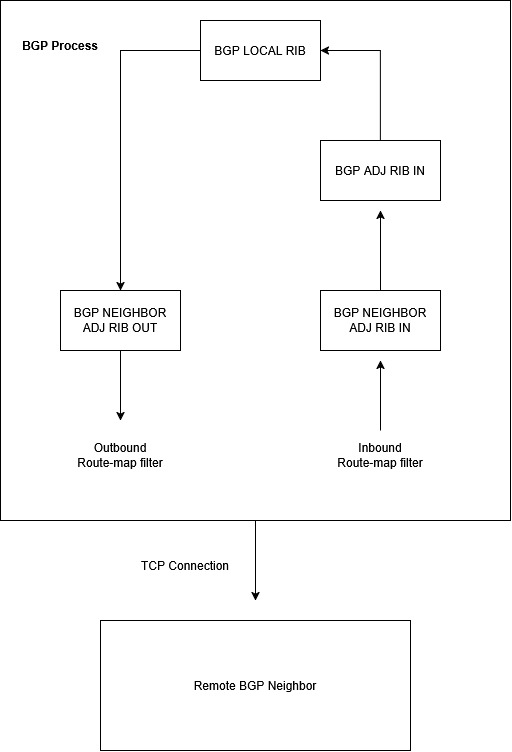

RustyBGP is my first attempt at a routing protocol written in, you guessed it, Rust.

**What is implemented:**

- Processing of the following BGP messages: Open, Keepalive, Updates
- Neighborship comes up
- Keeping the neighborship up
- Sending routes
- Receiving routes
- IPv4 Unicast Address Family
- Best path calculation
- Async via Tokio
- 2 byte and 4 byte ASN
- Resuming of neighbors after they go down
- Optional parameters for neighbors (capabilities like AS4, and other address families)
- Receiving and understanding (but not doing anything with) Notifications

**What's in progress:**

-  Console commands for displaying routes
-  Route filtering (inbound and outbound)

**What isn't implemented yet:**
-  GUI
-  Processing of BGP Notification
-  Handling of route refresh
-  Other address families (v6 or vpn)

No AI was used to generate any of the code in this project.

**Architecture Details**

In the below diagram I show how a route received from a BGP neighbor flows through the various RIBs in this program. 

Why have an ADJ RIB IN for both the neighbor and the BGP threads? 2 Reasons.

1. In the future, I will do the inbound and outbound route filtering at the neighbors. 
2. The routes in the BGP ADJ RIB IN are the ones that have been filtered but were not selected as the best paths. This allows me to clearly separate the best routes and be able to quickly promote or recover routes to prefixes. 

